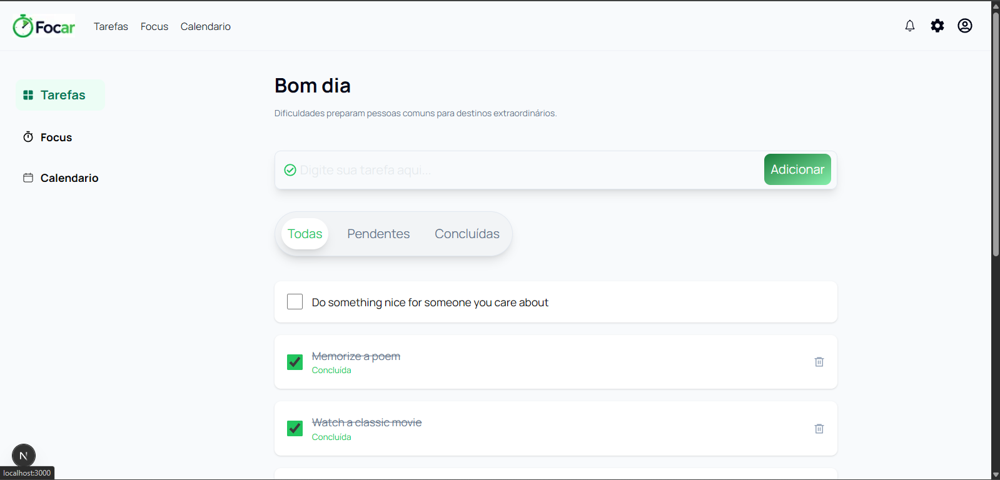

# Focar

## Sobre o Projeto

O **Focar** é uma aplicação web desenvolvida com **Next.js**, criada para auxiliar usuários na organização de tarefas, gerenciamento de foco e acompanhamento de datas por meio de um calendário.

O projeto foi desenvolvido com o objetivo de praticar conceitos modernos de desenvolvimento Frontend, incluindo:

* Consumo de APIs REST
* Gerenciamento de estado com React
* Componentização
* Organização de projetos por funcionalidades (Feature-Based Architecture)
* Tipagem com TypeScript
* Estilização com Tailwind CSS

Os dados das tarefas são consumidos através da API pública **DummyJSON**.


## Preview



---

## Funcionalidades

### Tarefas

* Adicionar novas tarefas
* Listar tarefas
* Filtrar tarefas:

  * Todas
  * Pendentes
  * Concluídas
* Marcar tarefas como concluídas
* Remover tarefas concluídas

---

### Focus

* Temporizador de foco
* Iniciar e pausar sessão
* Reiniciar cronômetro
* Aumentar tempo
* Diminuir tempo
* Mensagens motivacionais
* Sons ambientes:

  * Lo-fi
  * Rain
  * Forest
* Controle de volume

---

### Calendário

* Navegação entre meses
* Destaque para o dia atual
* Visualização mensal do calendário

---

## Tecnologias Utilizadas

### Principais

* Next.js (App Router)
* React
* TypeScript
* Tailwind CSS

### Bibliotecas

* React Icons

---

## Estrutura do Projeto

```text
src
│
├── app
│   ├── calendario
│   ├── foco
│   └── tarefas
│
├── features
│   ├── calendario
│   ├── foco
│   └── tarefas
│
├── lib
│
└── shared
```

### Organização

O projeto segue uma arquitetura baseada em funcionalidades (**Feature-Based Architecture**), onde cada módulo possui seus próprios componentes, mocks, serviços e tipos.

---

## API Utilizada

DummyJSON

Documentação:

https://dummyjson.com/docs/todos/

Endpoints utilizados:

```http
GET /todos
POST /todos/add
DELETE /todos/{id}
```

---

## Como Executar o Projeto

### Clonar o repositório

```bash
git clone URL_DO_REPOSITORIO
```

### Instalar dependências

```bash
npm install
```

### Executar em ambiente de desenvolvimento

```bash
npm run dev
```

O projeto estará disponível em:

```text
http://localhost:3000
```

---

## Objetivos do Projeto

Este projeto foi desenvolvido com foco em aprendizado e prática dos seguintes conceitos:

* React Hooks
* Next.js App Router
* Componentização
* Consumo de APIs REST
* TypeScript
* Gerenciamento de estado
* Organização de projetos escaláveis
* Boas práticas de Frontend

---
## Portfólio

No meu portfólio você encontrará um vídeo demonstrativo desta aplicação, além de outros projetos desenvolvidos por mim.


Portfólio: https://adriano-atbs.vercel.app/